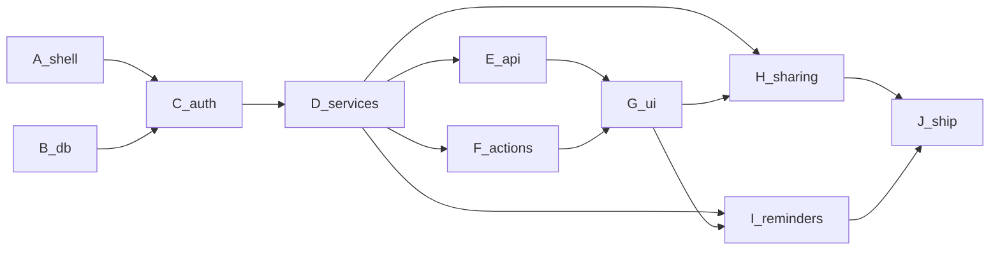

# Orbit MVP — Granular Build (agent handoff)

## How to use this plan

Each **Phase** is one agent conversation. Copy the phase's **Handoff prompt** into a new chat.

**Before any phase**

1. Read [`AGENTS.md`](AGENTS.md), [`CONTEXT.md`](CONTEXT.md), [`docs/spec.md`](docs/spec.md).
2. Read ADRs listed under that phase.
3. Read the matching **Phase** section in [`Orbit_Test_Plan.md`](Orbit_Test_Plan.md) - implement that phase's **What to test** items with the feature work.
4. Inventory the repo - skip steps whose deliverables already exist and match the spec.
5. Use Orbit terms only (Space, Task, Monthly, Note, Active Space, Invite, Reminder).
6. Do not expand MVP scope. Out-of-MVP is in the spec §9.
7. Prefer small diffs; stop when the phase **Acceptance** checklist passes **and** that phase's tests from the full test plan are green (keep prior-phase suites passing).

**Dependency chain**



**Early vertical slice (optional):** after D has Daily+authz, wire E/F/G for Daily only before Monthlies/custom - usable app sooner.

**Env (need by Phase C / I):** `DATABASE_URL`, `BETTER_AUTH_SECRET`, `BETTER_AUTH_URL`, `GOOGLE_CLIENT_ID/SECRET`, `MICROSOFT_CLIENT_ID/SECRET`, `RESEND_API_KEY`, `EMAIL_FROM`, `INNGEST_EVENT_KEY`, `INNGEST_SIGNING_KEY`

---

## Phase A — Shell and design

| | |
| --- | --- |
| **Goal** | Runnable Next.js app with static Orbit v2 chrome, no real data |
| **Read** | Spec §1 UI; prototype `prototypes/v2-agenda-feed.html` |
| **ADRs** | none |
| **Prereq** | none |

| Step | Deliverable |
| ---- | ----------- |
| **A1** | Next.js App Router + TS + Tailwind at repo root |
| **A2** | Orbit v2 tokens in `globals.css` (Instrument Sans + IBM Plex Mono) |
| **A3** | Static layout: header, Space switcher placeholder, nav **Upcoming / Daily / Monthlies** (+ custom placeholders), empty panel, compose bar, share bar. **No Shared tab** |

**Acceptance**

- [ ] `dev` runs; shell matches v2 look
- [ ] Nav order Upcoming → Daily → Monthlies; no Shared
- [ ] Tests: Phase A section of `Orbit_Test_Plan.md` (manual smoke only)

**Out of scope:** auth, DB, real data

**Handoff prompt**

```
Implement Orbit Phase A only (A1–A3) per Orbit_Granular_Build.md.
Read AGENTS.md, CONTEXT.md, docs/spec.md §1, and Phase A in Orbit_Test_Plan.md.
Build static Orbit v2 shell: no Shared tab; nav Upcoming / Daily / Monthlies.
Stop when Phase A acceptance checks pass. Do not start Phase B.
```

---

## Phase B — Database

| | |
| --- | --- |
| **Goal** | Drizzle schema + migrations for Spaces, Sections, Task/Monthly split, Notes, invites, reminder prefs/log |
| **Read** | Spec §5–7; CONTEXT Task vs Monthly |
| **ADRs** | [0001](docs/adr/0001-daily-monthlies-separate-domains.md), [0003](docs/adr/0003-space-timezone.md) |
| **Prereq** | A helpful but not required |

| Step | Deliverable |
| ---- | ----------- |
| **B1** | Drizzle + serverless PG client, `drizzle.config.ts`, `.env.example` |
| **B2** | Better Auth Drizzle schema |
| **B3** | `space` (incl. **timezone**) + `space_member` |
| **B4** | `section` (kinds + isSystem + sortOrder) |
| **B5** | Checklist **Task** storage for Daily/custom only - cannot belong to monthlies section |
| **B6** | **Monthly** storage (own table **or** constrained rows) + due day / nextDueAt; clamp rule documented in service later |
| **B7** | `note`, `invite` (email, role, token, expiresAt), `notification_preference` (userId+spaceId), `notification_log` |
| **B8** | Seed helper: Space + Daily + Monthlies system sections |

**Acceptance**

- [ ] Migrations apply cleanly
- [ ] Schema can express timezone, invites, per-user-per-space prefs
- [ ] Domain split enforceable (no Task row in Monthlies / no Monthly in Daily)
- [ ] Tests: Phase B section of `Orbit_Test_Plan.md` green (Vitest + `DATABASE_URL_TEST`)

**Out of scope:** HTTP, UI, auth runtime

**Handoff prompt**

```
Implement Orbit Phase B only (B1–B8) per Orbit_Granular_Build.md.
Read AGENTS.md, CONTEXT.md, docs/spec.md §5–7, ADRs 0001 and 0003, and Phase B in Orbit_Test_Plan.md.
Schema must enforce Task vs Monthly separation and include space.timezone + invites + notification_preference per user per space.
Add the Phase B test harness and must-pass db tests from the test plan; phase is incomplete until those pass.
Stop at Phase B acceptance. Do not start Phase C.
```

---

## Phase C — Authentication

| | |
| --- | --- |
| **Goal** | Sign-up/in, OAuth, verify-before-app, Personal Space onboarding |
| **Read** | Spec §3–4 |
| **ADRs** | [0002](docs/adr/0002-mvp-auth-providers.md) |
| **Prereq** | B |

| Step | Deliverable |
| ---- | ----------- |
| **C1** | `lib/auth.ts` - email/password + Google + Microsoft |
| **C2** | `app/api/auth/[...all]/route.ts` |
| **C3** | Resend for verification + password reset |
| **C4** | Auth client + sign-in/sign-up UI |
| **C5** | Protected `(app)` layout; **block unverified** email/password users |
| **C6** | Post-login: ensure Personal Space + system Sections; timezone from creator |

**Acceptance**

- [ ] Email+password and both OAuth paths work in dev
- [ ] Unverified email users cannot use the app
- [ ] First login yields Personal Space with Daily + Monthlies
- [ ] Tests: Phase C section of `Orbit_Test_Plan.md` green (OAuth browser click-through may stay manual)

**Out of scope:** invites UI, reminders jobs

**Handoff prompt**

```
Implement Orbit Phase C only (C1–C6) per Orbit_Granular_Build.md.
Read AGENTS.md, CONTEXT.md, docs/spec.md §3–4, ADR 0002, and Phase C in Orbit_Test_Plan.md.
Better Auth: email/password + Google + Microsoft; verify email before app access; create Personal Space + Daily/Monthlies on first login.
Implement Phase C tests from the test plan with the feature work; keep prior-phase suites passing.
Stop at Phase C acceptance. Do not start Phase D.
```

---

## Phase D — Domain services

| | |
| --- | --- |
| **Goal** | All business rules in `lib/services` + authz; no Route Handlers yet |
| **Read** | Spec §4–6; full CONTEXT |
| **ADRs** | 0001, 0003 |
| **Prereq** | B, C |

**Before D3 / Section mutation preflight**

- Add a database migration and regression test that reject changes to `section.kind`. The composite foreign keys currently use `ON UPDATE CASCADE` to keep mirrored child kinds synchronized, but the product does not allow Sections to be retyped. Enforce immutability at the database layer before exposing Section mutation services.
- Make `updated_at` reliable for service updates before Section rename/reorder writes land. Prefer one consistent strategy for all mutable tables, such as a database trigger or explicit service-managed timestamps, and test the chosen behavior.

| Step | Deliverable |
| ---- | ----------- |
| **D1** | `requireMembership` - owner / editor / read-only |
| **D2** | Spaces: list, get, create (tz default), update tz, delete (last-Space guard) |
| **D3** | Sections: list, create custom, rename, reorder customs only, delete custom; block system mutate; preserve immutable Section kinds and reliable `updated_at` values |
| **D4** | Daily Tasks CRUD + complete/reopen (no auto-reset); move among Daily/custom only |
| **D5** | Monthlies CRUD + complete advances nextDueAt; short-month clamp; **no move** to/from Task sections |
| **D6** | Custom section Tasks CRUD + moves (not into Monthlies) |
| **D7** | Notes CRUD (plain text) for notes/mixed; many notes |
| **D8** | Members: invite (default read-only, 7-day expiry), accept, list, update role, remove, **ownership transfer**, leave guards |
| **D9** | Notifications service: candidate scan + Resend send + log write (callable from Inngest later) |

**Acceptance**

- [ ] Unit/integration smoke: cannot move Task↔Monthly; read-only cannot mutate; invite expiry field set
- [ ] Section kind changes are rejected by the database, including direct update attempts
- [ ] Completing Monthly rolls next due with clamp
- [ ] Reminder recipient logic: Assignee else Owner
- [ ] Tests: Phase D section of `Orbit_Test_Plan.md` green (full services matrix)

**Out of scope:** HTTP routes, Inngest wire-up, full UI

**Handoff prompt**

```
Implement Orbit Phase D only (D1–D9) per Orbit_Granular_Build.md.
Read AGENTS.md, CONTEXT.md, docs/spec.md §4–6, ADRs 0001 and 0003, and Phase D in Orbit_Test_Plan.md.
Encode domain invariants in lib/services + lib/authz (Task≠Monthly, roles, invites, ownership transfer, reminder recipient rules).
Implement the Phase D service/authz tests from the test plan; this is the core suite. Keep prior-phase suites passing.
No Route Handlers or UI wiring unless needed for smoke tests.
Stop at Phase D acceptance. Do not start Phase E.
```

---

## Phase E — `/api/v1` Route Handlers

| | |
| --- | --- |
| **Goal** | Thin JSON API over domain services |
| **Read** | Spec §8; ADR 0005 |
| **ADRs** | [0005](docs/adr/0005-dual-api-surface.md) |
| **Prereq** | D |

| Step | Deliverable |
| ---- | ----------- |
| **E1** | Shared Zod validate + error shape |
| **E2** | Spaces CRUD (+ timezone patch) |
| **E3** | Sections under space |
| **E4** | Tasks (+ complete/reopen/move as supported) |
| **E5** | Monthlies (+ complete) |
| **E6** | Notes |
| **E7** | Members/invites (pending list, create/resend/accept; no cancellation) + notification preferences |

**Acceptance**

- [x] Authenticated CRUD works for happy paths
- [x] Authz errors for read-only / non-members
- [x] Handlers only call services (no inline business rules)
- [x] Tests: Phase E section of `Orbit_Test_Plan.md` green (thin API; do not re-test full D matrix)

**Out of scope:** Server Actions, pixel UI

**Handoff prompt**

```
Implement Orbit Phase E only (E1–E7) per Orbit_Granular_Build.md.
Read AGENTS.md, docs/spec.md §8, ADR 0005, and Phase E in Orbit_Test_Plan.md.
Thin /api/v1 Route Handlers over existing lib/services; Zod at boundary; no duplicated domain logic.
Implement Phase E API tests from the test plan; keep prior-phase suites passing.
Stop at Phase E acceptance. Do not start Phase F.
```

---

## Phase F — Server Actions

| | |
| --- | --- |
| **Goal** | Web-only actions for compose/complete/sections/invite |
| **Read** | Spec §8; ADR 0005 |
| **ADRs** | 0005 |
| **Prereq** | D |

| Step | Deliverable |
| ---- | ----------- |
| **F1** | `quickAdd` - scoped to selected Section; no-op/disabled for Upcoming |
| **F2** | `toggleComplete` for Task/Monthly |
| **F3** | Custom section create/rename/reorder |
| **F4** | `sendInvite` + revalidate |

**Acceptance**

- [ ] Actions call same services as API
- [ ] `revalidatePath` keeps RSC in sync
- [ ] Tests: Phase F section of `Orbit_Test_Plan.md` green

**Out of scope:** Reminder jobs, accept-invite page (H)

**Handoff prompt**

```
Implement Orbit Phase F only (F1–F4) per Orbit_Granular_Build.md.
Read AGENTS.md, docs/spec.md §8, ADR 0005, and Phase F in Orbit_Test_Plan.md.
Web-only Server Actions for quick-add, complete, section management, invite - thin wrappers over lib/services.
Implement Phase F action tests from the test plan; keep prior-phase suites passing.
Stop at Phase F acceptance. Do not start Phase G.
```

---

## Phase G — Wire UI

| | |
| --- | --- |
| **Goal** | Orbit agenda UI on real data for Active Space |
| **Read** | Spec §1, §5; CONTEXT Active Space / Upcoming |
| **ADRs** | 0001 |
| **Prereq** | E and/or F |

**Status: complete.** G1-G10 shipped across PR #9 (ui-wiring: G1-G4) and the
`custom-section-pages` branch (G5-G10, shared dialog primitive, share bar),
plus Playwright E2E. Historical notes that shaped G5-G10 are kept below for
context on why the pages look the way they do.

| Step | Deliverable | Status |
| ---- | ----------- | ------ |
| **G1** | Space switcher → Active Space | done |
| **G2** | Daily: list Tasks; hide completed by default + show-completed; compose + complete | done |
| **G3** | Monthlies: list; complete rolls next due | done |
| **G4** | Upcoming: read-only timeline; no compose | done |
| **G5** | Custom **tasks** Section view: list + complete + compose (reuse `TaskRow`/`ComposeBar`) | done |
| **G6** | Custom **notes** Section view: list + edit (notes are plain text, no complete) | done |
| **G7** | **Mixed** Section view: Tasks and Notes in one list | done |
| **G8** | Add Section (name + kind) UI entry point | done |
| **G9** | Read-only UI: disable mutations + badges | done |
| **G10** | Share bar: avatars, roles, invite entry point | done |

**Architecture notes (historical, but they describe the shipped pages)**

- The read layer was refactored twice after PR #9. Space views must use
  `getSpaceViewer(spaceId)` / `getSpaceSections(spaceId)` from
  `lib/spaces/viewer.ts` (single session touchpoint, React-cached per render).
  Never call `requireVerifiedSession`/`requireMembership` from a page.
- Pages are **streaming shells** (perf round 3, see `query-performance-plan.md`
  and `performance.md`): each section page returns a thin shell and streams
  its data-dependent content inside `<Suspense>`; the route's `loading.tsx`
  doubles as the Suspense fallback (one skeleton per route). Follow that shape
  for the new Section pages.
- The data layer for G5-G7 is **already complete** - do not add services:
  Tasks accept `tasks`/`mixed` Sections (`lib/services/tasks.ts`), Notes
  accept `notes`/`mixed` (`lib/services/notes.ts`), and `quick-add`
  (`lib/actions/quick-add.ts`) already dispatches Task/Monthly/Note by the
  target Section's kind.
- Section management actions exist (`lib/actions/sections.ts`:
  `createSection`, `renameSection`, `reorderSections`, `deleteSection`) -
  G8 is a UI entry point over these, not new actions.
- `viewer.can.mutateContent` (editor+) gates every compose/toggle; G9 makes
  that gating systematic plus visible badges for read-only Members.
- Server components cannot live inside client-component trees: cross the
  boundary with React-element slot props (see `ShareBarSlot` /
  `SidebarSpaces` passed into `SpaceLayout`). Change-password visibility
  is batched in `getSpaceViewer` as `viewer.can.changePassword` and passed
  to the sidebar via `canChangePassword`; the change-password page still
  enforces via `requireCredentialSession`.

**Acceptance**

- [x] Nav Upcoming → Daily → Monthlies → customs; no Shared (custom **tasks** Sections render as of G5; notes/mixed land in G6-G7)
- [x] Active Space scopes all views
- [x] Custom section pages render Tasks/Notes/Mixed content (G5-G7; Tasks and Notes render as of G5-G6, Mixed is G7)
- [x] Add Section flow creates usable Sections (G8)
- [x] Read-only member cannot mutate from UI (G9)
- [x] Share bar shows members; invite entry visible to Owner (G10)
- [x] Tests: Phase G items 1-8 green via Playwright - `e2e/active-space.spec.ts`, run with `npm run test:e2e` and wired into CI as the `e2e` job (dedicated Neon branch via `DATABASE_URL_E2E`).

**Out of scope:** Inngest, email template polish (I/H)

*Phase G is complete - there is no G handoff prompt. Continue with Phase H.*

---

## Phase H - Sharing

| | |
| --- | --- |
| **Goal** | Invite email, accept flow, ownership transfer, RBAC audit |
| **Read** | Spec §4 |
| **ADRs** | none new (roles in CONTEXT) |
| **Prereq** | D, G recommended |
| **Status** | Complete |

| Step | Deliverable | Status |
| ---- | ----------- | ------ |
| **H1** | Invite email template + send on invite | done |
| **H2** | Accept-invite page (token digest; create/join Member); expired Invite UX | done |
| **H3** | Ownership transfer UI/API path | done |
| **H4** | Audit: every mutation uses `requireMembership` with correct min role | done |

**Acceptance**

- [x] Invite → email → accept → Member at chosen role (default read-only)
- [x] Expired Invite rejected; resend works
- [x] Owner can transfer; leave/delete guards hold
- [x] Tests: Phase H section of `Orbit_Test_Plan.md` green (`e2e/invite.spec.ts` + authz contract)

**Out of scope:** Reminder cron

*Phase H is complete - there is no H handoff prompt. Continue with Phase I.*

---

## Phase I - Reminders

| | |
| --- | --- |
| **Goal** | Inngest scans + Resend Reminder emails + prefs UI |
| **Read** | Spec §6 |
| **ADRs** | [0003](docs/adr/0003-space-timezone.md), [0004](docs/adr/0004-inngest-reminders.md) |
| **Prereq** | D9, C (Resend) |

| Step | Deliverable |
| ---- | ----------- |
| **I1** | Templates: monthly-due, daily-nudge |
| **I2** | Inngest client + `app/api/inngest/route.ts` |
| **I3** | Job: Monthlies due in N days (Space tz) → email Assignee else Owner |
| **I4** | Job: Daily Tasks due today or overdue → same recipient rules |
| **I5** | Prefs UI: days-before + email on/off per Active Space |

**Acceptance**

- [ ] Jobs idempotent via notification_log
- [ ] Prefs default N=3; per user per Space
- [ ] Times interpreted in Space timezone
- [ ] Tests: Phase I section of `Orbit_Test_Plan.md` green

**Out of scope:** Push notifications

**Handoff prompt**

```
Implement Orbit Phase I only (I1–I5) per Orbit_Granular_Build.md.
Read AGENTS.md, CONTEXT.md, docs/spec.md §6, ADRs 0003 and 0004, and Phase I in Orbit_Test_Plan.md.
Inngest + Resend Reminders; Assignee else Owner; Space timezone; idempotent log; prefs per user per space.
Implement Phase I reminder/prefs tests from the test plan; keep prior-phase suites passing.
Stop at Phase I acceptance. Do not start Phase J.
```

---

## Phase J — Ship

| | |
| --- | --- |
| **Goal** | Another engineer can run and deploy |
| **Read** | Spec §10 |
| **ADRs** | none |
| **Prereq** | H + I (or MVP subset you choose to ship) |

| Step | Deliverable |
| ---- | ----------- |
| **J1** | `.env.example` + README (setup, OAuth redirect URIs, Inngest) |
| **J2** | Vercel deploy + prod OAuth/Inngest/Resend config |

**Acceptance**

- [ ] README alone is enough for local setup
- [ ] Prod sign-in and one Reminder path verified
- [ ] Tests: Phase J section of `Orbit_Test_Plan.md` done (CI + README testing docs; full suite still green)

**Handoff prompt**

```
Implement Orbit Phase J only (J1–J2) per Orbit_Granular_Build.md.
Read AGENTS.md, docs/spec.md §10, and Phase J in Orbit_Test_Plan.md.
Ship docs + Vercel production config. Wire CI/README testing instructions from the test plan. Do not add features.
```

---

## Explicitly not in MVP

Push/in-app notifications; native mobile; RRULE; per-section ACL; subtasks; tags; search; calendar sync; Shared tab; GitHub OAuth; markdown/rich notes. See spec §9.
