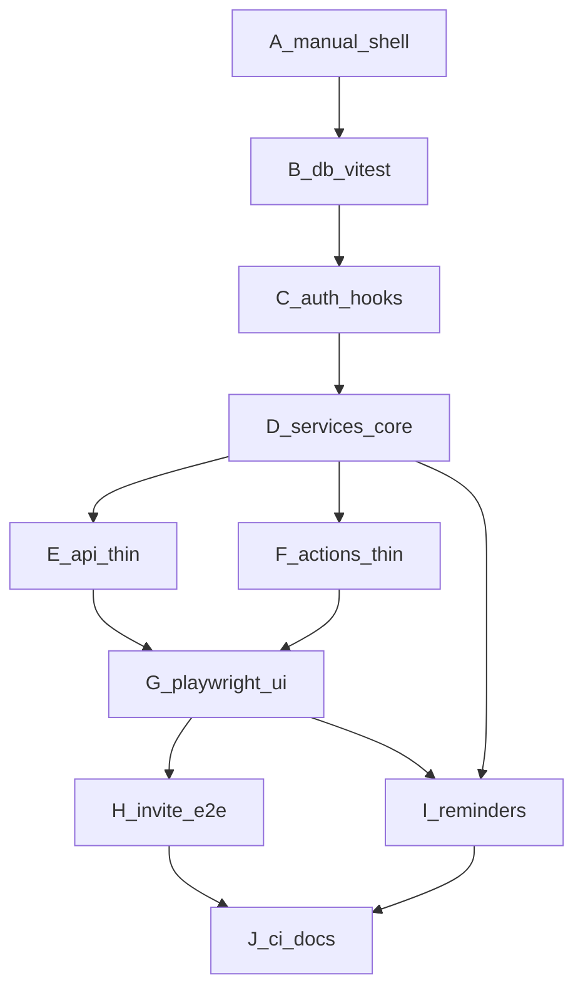

# Orbit test plan (all phases A–J)

Cross-cutting strategy for the MVP. Implement tests **in the same phase** as the feature they guard. Do not backfill an entire suite in Phase J.

**Agent rule:** `[AGENTS.md](AGENTS.md)` requires reading this file's matching Phase section before implementing any build phase. Phase exit = feature Acceptance **and** that phase's **What to test** items green. Handoff prompts live in `[Orbit_Granular_Build.md](Orbit_Granular_Build.md)`.

## Status (hardening pass)

| Phases | Status |
| ------ | ------ |
| **B–G** | Done. Gaps closed in the hardening pass (authz/IDOR, invite collisions, calendar/Reminder pinning, Phase G E2E, harness safety). |
| **H** | Done. Invite accept/expiry/transfer E2E (`e2e/invite.spec.ts`), requireMembership contract audit, ShareBar management. |
| **I** | Still pending (prefs E2E, Inngest handler tests). |
| **J** | Partially landed (CI `test`/`e2e`/`typecheck`, README Neon branch note); required-check promotion and prod smoke remain. |

**Authz footguns (do not regress):** Owner-only tests need an **editor** actor (read-only 403 is not enough). Entity fetches need a cross-Space IDOR case (`spaceId` A + entity id from Space B).

## Stack (locked)


| Layer              | Choice                                                                                                      |
| ------------------ | ----------------------------------------------------------------------------------------------------------- |
| Unit / integration | **Vitest** (Node)                                                                                           |
| DB                 | Real **Neon** Postgres. Vitest uses `DATABASE_URL_TEST`; Playwright uses `DATABASE_URL_E2E` (separate dedicated branches; ~7d TTL for throwaway test branches) |
| E2E                | **Playwright** from Phase G                                                                                 |
| Scripts            | `test`, `test:watch`, `test:db`; from G: `test:e2e`                                                         |


No SQLite. Prefer service tests for business rules; keep Route Handlers / Server Actions thin. Bug fixes should add or extend the closest automated test; user-visible bugs get a Playwright repro when the app is interactive (G+).

## Layout

```
tests/
  setup/          # env + drizzle client + migrate/truncate
  db/             # B
  auth/           # C
  services/       # D (+ I notification service)
  api/            # E
  actions/        # F
e2e/              # G, H, I UI flows
vitest.config.ts
playwright.config.ts   # from G
```

## Layer map




---

## Phase A — Shell (already done)

**Goal of tests:** none automated beyond existing lint/build. Static chrome is validated manually against the prototype.

**What to verify (manual / smoke):**

- `npm run dev` loads; AgendaShell renders.
- Nav order: Upcoming → Daily → Monthlies → custom placeholders; **no Shared**.
- Upcoming hides compose; other sections show compose placeholder.
- Error surfaces exist: `[app/error.tsx](app/error.tsx)`, `[app/global-error.tsx](app/global-error.tsx)`, `[app/not-found.tsx](app/not-found.tsx)`.

**Do not add** component snapshot suites for the static shell unless a later bug needs a regression lock.

---

## Phase B — Database (harness starts here)

**Add:** Vitest, `tests/setup`, `tests/db`, `DATABASE_URL_TEST` in `[.env.example](.env.example)`, testing note in `[AGENTS.md](AGENTS.md)`. Default schema: **separate `monthly` table**.

**What to test:**

1. Migrations apply cleanly on empty Neon branch; second migrate is safe or no-op.
2. Better Auth tables exist after migrate (existence only).
3. Seed creates Space with `timezone` + system Sections `daily` and `monthlies` (`isSystem`, sort order); no customs.
4. Illegal inserts fail: Task into Monthlies section; Monthly outside Monthlies section.
5. Smoke insert/read: `invite` (role + `expiresAt`), `notification_preference` (unique userId+spaceId), `notification_log` (unique idempotency key).
6. Missing `DATABASE_URL_TEST` fails loudly for `test:db` (no silent green).

**Out of scope:** auth flows, HTTP, UI.

---

## Phase C — Authentication

**Add:** `tests/auth/` (integration against DB + auth helpers; mock Resend).

**What to test:**

1. After verified first login / onboard hook: Personal Space exists with Daily + Monthlies; timezone set from creator default.
2. Unverified email/password user is blocked from `(app)` (layout/guard unit or integration).
3. OAuth-verified users are treated as verified (no email-verify block).
4. Second login does **not** duplicate Personal Space / system Sections.
5. Password-reset / verification email send is invoked with expected args (Resend mocked).

**Manual / deferred to E2E:** full Google/Microsoft click-through in browser (document as Phase C acceptance; automate in G/H only if flaky risk is low).

---

## Phase D — Domain services (largest suite)

**Add:** `tests/services/` + `tests/services/authz`. This is the **source of truth** for product rules (`[docs/spec.md](docs/spec.md)` §4–6, ADR 0001/0003).

**What to test:**

**Authz (`requireMembership`)**

- Non-member → deny.
- Read-only → read ok; create/update/delete/complete denied.
- Editor → content + custom Sections ok; invite/role/ownership denied.
- Owner → full; single-owner invariants.

**Spaces**

- Create defaults timezone; update timezone; delete blocked when last remaining Space; list scoped to membership.

**Sections**

- Cannot delete/rename/retype system Daily/Monthlies; cannot reorder system with customs incorrectly.
- Custom create/rename/reorder/delete for editor+.

**Tasks (Daily + custom tasks/mixed)**

- CRUD; complete stays complete (no midnight reset).
- Move among Daily and custom task/mixed only.
- Reject move into Monthlies / reject create in Monthlies.

**Monthlies**

- CRUD only in Monthlies section.
- Complete advances `nextDueAt`; short months clamp (e.g. day 31 → Feb last day).
- Reject move to/from Task sections (delete+recreate only).

**Notes**

- Allowed in `notes`/`mixed`; plain text; many Notes per Section; no complete/assignee.

**Members / Invites**

- Invite default role read-only; `expiresAt` ≈ now+7d; accept creates Member; expired reject; resend refreshes expiry.
- Ownership transfer; Owner cannot leave with Members without transfer; an Owner-only Space must be deleted instead of left ownerless; cannot delete/leave last Space.

**Reminders (service only, D9)**

- Recipient = Assignee if set else Owner.
- Opt-out / prefs respected.
- Candidate selection for monthly N-days-before and daily due/overdue (Space timezone).
- Writing `notification_log` prevents duplicate key on retry.

---

## Phase E — `/api/v1` Route Handlers

**Add:** `tests/api/` calling handlers or `fetch` against test server; auth session stubbed.

**What to test:**

1. Happy-path CRUD for spaces, sections, tasks, monthlies, notes, members/invites, prefs.
2. Zod validation → consistent 400 error shape.
3. Unauthenticated → 401; non-member → 403; read-only mutation → 403.
4. Handlers do not re-implement domain rules (spot-check: one Task↔Monthly reject still returns via service error mapping).
5. No duplicated assertion of clamp/move matrices already covered in D (one smoke each is enough).

---

## Phase F — Server Actions

**Add:** `tests/actions/` invoking actions with mocked session + same DB.

**What to test:**

1. `quickAdd` targets selected Section; **Upcoming** no-ops or rejects.
2. `toggleComplete` for Task and Monthly (Monthly uses service complete/advance).
3. Custom section create/rename/reorder call services; system Section mutations rejected.
4. `sendInvite` creates invite + triggers revalidate (assert `revalidatePath` called with expected paths; email mocked).
5. Read-only session cannot mutate via actions.

---

## Phase G — Wire UI (Playwright starts)

**Add:** Playwright, `e2e/`, seed helpers for a verified user + Space fixtures. Suite files are named by domain (`e2e/active-space.spec.ts`, `e2e/spaces.spec.ts`), not by build phase.

**What to test (E2E):**

1. Nav order Upcoming → Daily → Monthlies → customs; no Shared tab.
2. Active Space switch changes listed content (two Spaces with distinct Tasks).
3. Daily: compose adds Task; complete hides by default; show-completed reveals.
4. Daily compose with optional due date: dated Task appears in Daily and Upcoming; undated Task does not appear in Upcoming.
5. Monthlies: complete updates next due display.
6. Monthlies compose with optional Description; Description displays on the Monthlies row.
7. Upcoming: shows dated items; **no** compose control.
8. Custom section add (name + kind) and content for tasks/notes/mixed.
9. Cancel then confirm delete for Task, Monthly, and Note; completed Task can be deleted from show-completed.
10. Read-only member: mutation controls disabled/absent; cannot complete via UI; seeded content has no row menus.
11. Share bar shows members; invite entry visible to Owner.

**Visual:** fail on obvious chrome regressions vs Orbit tokens (nav order, missing Shared) - not full pixel suite.

---

## Phase H - Sharing

**Extend:** `tests/services` audit gaps + `e2e/invite.spec.ts`.

**Status:** Done. Coverage lives in `e2e/invite.spec.ts`, `tests/services/authorization-contract.test.ts`, and existing members/invite action suites.

**What to test:**

1. E2E: Owner invites → accept page with token → Member at chosen role (default read-only).
2. E2E: expired token shows reject UX; resend then accept works.
3. E2E/API: ownership transfer; former Owner becomes Editor; leave/delete guards.
4. Static/audit test or grep-backed checklist: mutating service entrypoints call `requireMembership` with correct min role (Owner for invite/role/transfer).
5. Invite email send mocked; template receives Space name + accept URL.

---

## Phase I — Reminders

**Extend:** `tests/services/notifications`* + optional `e2e/prefs.spec.ts`; Inngest functions tested by invoking the underlying service/job handler (mock Resend; do not depend on live Inngest cloud in CI).

**What to test:**

1. Monthly job: due in N days in **Space timezone**; emails Assignee else Owner.
2. Daily job: incomplete due today or overdue; same recipient rules.
3. Idempotency: second run does not double-send (`notification_log` unique key).
4. Prefs: default `daysBefore=3`; `emailEnabled=false` suppresses; prefs are per user per Space.
5. E2E smoke: prefs UI saves and round-trips for Active Space.

---

## Phase J — Ship

**Add:** README testing section + required checks (CI scaffold already exists: `[.github/workflows/ci.yml](../../.github/workflows/ci.yml)` lint/build; `test`/`e2e` jobs commented until B/G).

**What to verify:**

1. GitHub Action (or equivalent): `npm test` against Neon branch/`DATABASE_URL_TEST` secret; Playwright against `DATABASE_URL_E2E` (local server in CI) when secrets exist.
2. README documents how to create separate Neon branches for Vitest and E2E, set `DATABASE_URL_TEST` / `DATABASE_URL_E2E`, run `test` / `test:e2e`.
3. Prod smoke checklist (manual ok): sign-in + one Reminder path; link from README.
4. Confirm `.env.example` lists all test-related vars.

---

## Phase exit rule

A phase is not done until its **What to test** list is green (or explicitly manual for OAuth click-through in C). Later phases must keep earlier suites passing - do not delete B/D tests when adding E2E.

## Docs

`[AGENTS.md](../../AGENTS.md)` lists this plan in Read order and under **Testing (required per phase)**. The granular build plan's **Before any phase** checklist and each phase Acceptance/handoff already point here - keep those links in sync if this file is renamed.