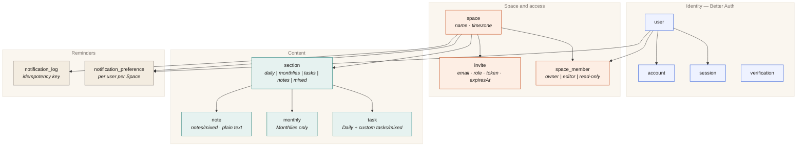
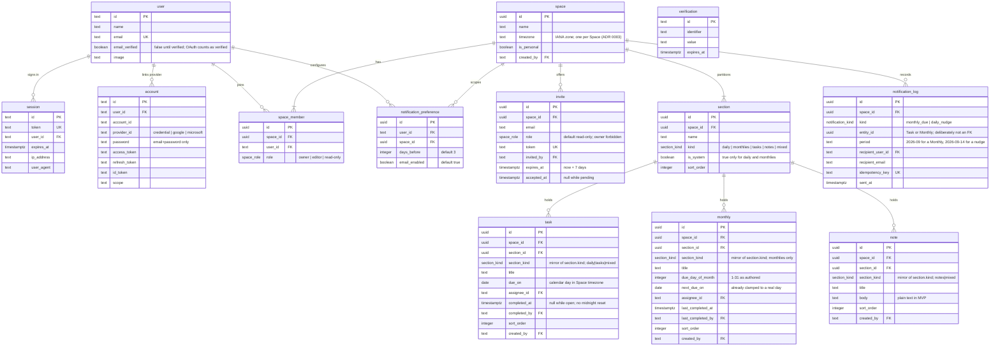
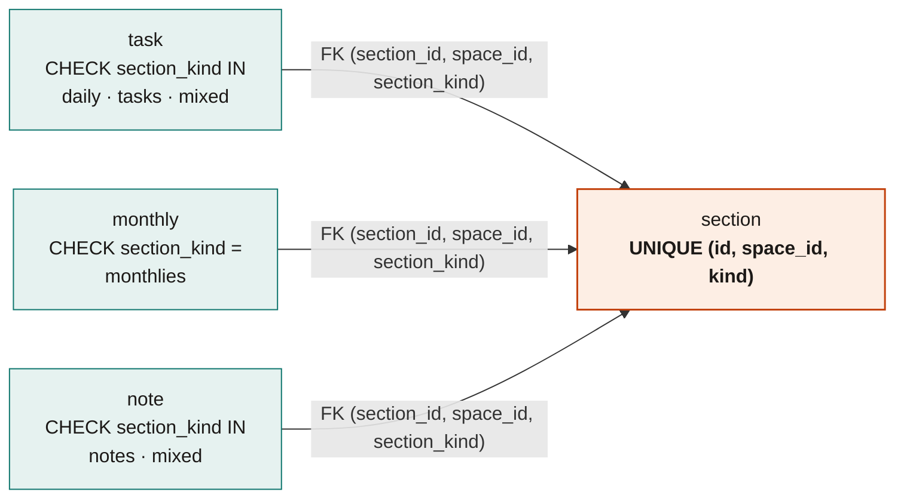

# Orbit data model

Physical schema as built in Phase B. Source of truth is [`lib/db/schema.ts`](../lib/db/schema.ts); migrations live in [`drizzle/`](../drizzle/). Vocabulary: [`CONTEXT.md`](../CONTEXT.md). Logical model: [`docs/spec.md`](./spec.md) §7.

## Map

Four clusters. Everything below `space` is deleted with it.

`verification` stands alone — Better Auth keys it by email/token, not by `user.id`.

## Entities and columns

Every table carries `created_at` / `updated_at` (`timestamptz`, defaulted); they are omitted below for legibility.

`task`, `monthly`, and `note` also point at `user` through `assignee_id`, `created_by`, and the completion columns. Those edges are left off the diagram above so the Section relationships stay readable; all of them are `ON DELETE SET NULL`, so removing a Member never deletes content.

## Enums

| Type | Values |
| --- | --- |
| `space_role` | `owner`, `editor`, `read-only` |
| `section_kind` | `daily`, `monthlies`, `tasks`, `notes`, `mixed` |
| `notification_kind` | `monthly_due`, `daily_nudge` |

## How Task vs Monthly is enforced

ADR 0001 says the two are separate domains forever. Rather than trust the services, the schema makes the illegal row unrepresentable.

`section` exposes a three-column unique key, and each content table stores a **mirror** of the Section's kind that is pinned to it by a composite foreign key and narrowed by a `CHECK`:

The pair closes both escape routes. Claiming `section_kind = 'monthlies'` on a Task trips the `CHECK`; claiming a legal kind while pointing `section_id` at the Monthlies Section trips the foreign key, because no `section` row matches that `(id, space_id, kind)` triple. Including `space_id` in the same key means a row can never reference a Section in another Space. `ON UPDATE CASCADE` keeps the mirrors honest if a Section's kind ever changes, and the child `CHECK` then rejects any change that would strand its rows.

`tests/db/domain-split.test.ts` exercises both the honest and the sneaky attempt for each table.

## Other invariants held by the database

| Constraint | Rule it protects |
| --- | --- |
| `space_member_single_owner_unique` | Partial unique index on `space_id where role = 'owner'` — one Owner per Space |
| `space_member_space_user_unique` | A user joins a Space once |
| `section_space_system_kind_unique` | Partial unique index on `(space_id, kind) where is_system` — exactly one Daily and one Monthlies |
| `section_system_kind_match` | `is_system` is true if and only if the kind is `daily` or `monthlies`; no custom Section can impersonate a system one |
| `invite_role_not_owner` | Ownership moves by transfer, never by Invite |
| `invite_space_email_pending_unique` | Partial unique index `where accepted_at is null` — one pending Invite per email per Space, re-invitable after acceptance |
| `notification_preference_user_space_unique` | Reminder preference is per user **per Space** |
| `notification_preference_days_before_range` | `days_before between 0 and 30` |
| `monthly_due_day_range` | `due_day_of_month between 1 and 31` |
| `notification_log_idempotency_key_unique` | An Inngest retry cannot double-send |

## Delete behaviour

| Deleting | Effect |
| --- | --- |
| `space` | Cascades to members, invites, sections, tasks, monthlies, notes, preferences, and its notification log |
| `section` | Cascades to its tasks, monthlies, and notes |
| `user` | Cascades to sessions, accounts, memberships, and preferences; **nulls** assignee / creator / completer columns and `space.created_by`, so content and history survive |

`notification_log.entity_id` is intentionally not a foreign key: the send record outlives the Task or Monthly it was about.

## Vocabulary to table

| CONTEXT term | Where it lives |
| --- | --- |
| Space, Personal Space | `space` (`is_personal`) |
| Active Space | Not stored in Phase B — a client/session concern |
| Member, Owner / Editor / Read-only | `space_member.role` |
| Invite | `invite` |
| Section, Daily, Monthlies | `section` (`kind`, `is_system`) |
| Task | `task` |
| Monthly | `monthly` |
| Note | `note` |
| Assignee | `task.assignee_id`, `monthly.assignee_id` |
| Upcoming | Not a table — a read-only view over `monthly.next_due_on` and `task.due_on` |
| Reminder | `notification_preference` + `notification_log` |
