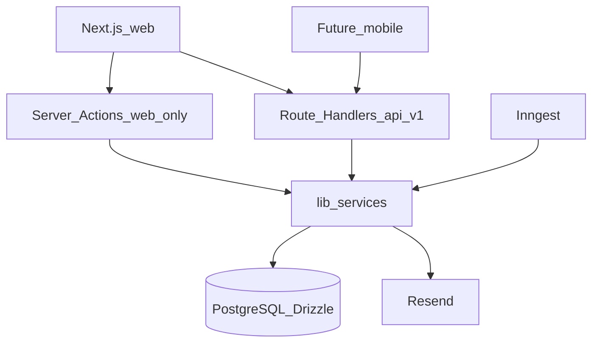

# Orbit MVP Spec

Build-ready requirements from the domain grilling session. Vocabulary: [`CONTEXT.md`](../CONTEXT.md). Hard decisions: [`docs/adr/`](./adr/). Build phases: [`Orbit_Granular_Build.md`](../Orbit_Granular_Build.md).

## 1. Product

Orbit is a **household-first** coordination app for day-to-day to-dos and recurring monthly obligations. Solo use works via a Personal Space; sharing is a first-class path, not an afterthought.

UI reference: [`prototype/ui-prototype.html`](../prototype/ui-prototype.html) (agenda + Spaces sidebar) and [`prototype/ui-spaces.html`](../prototype/ui-spaces.html) (all Spaces directory). Warm paper, Instrument Sans + IBM Plex Mono. Nav: **Upcoming → Daily → Monthlies → custom Sections**. No Shared tab. Spaces listed in the sidebar with **View all** / full directory for many Spaces.


## 2. Stack (locked)

| Layer | Choice |
| ----- | ------ |
| App | Next.js App Router, TypeScript, React |
| UI | Orbit v2 tokens (CSS variables / Tailwind) |
| Auth | Better Auth: email/password + Google + Microsoft ([ADR 0002](./adr/0002-mvp-auth-providers.md)) |
| DB | PostgreSQL + Drizzle (`DATABASE_URL`) |
| Email | Resend |
| Jobs | Inngest ([ADR 0004](./adr/0004-inngest-reminders.md)) |
| Host | Vercel |



- **`/api/v1` Route Handlers**: mobile-ready CRUD (spaces, sections, tasks, monthlies, notes, members/invites, reminder prefs). Zod at the boundary. Auth via Better Auth session (bearer later for mobile).
  - Invite API: `GET /api/v1/spaces/{spaceId}/invites` lists pending Invites for the Owner; `POST /api/v1/spaces/{spaceId}/invites` creates one; `POST /api/v1/invites/{inviteId}/resend` refreshes expiry; `POST /api/v1/invites/accept` accepts by token. Invite cancellation is out of MVP.
- **Server Actions**: web UX only (quick-add, complete, section reorder, invite + revalidate). Same `lib/services/*` - no duplicated logic ([ADR 0005](./adr/0005-dual-api-surface.md)).

## 3. Accounts

- Sign up / sign in: email+password, Google, Microsoft.
- Email/password users must **verify email before using the app**. OAuth counts as verified.
- Password reset via Resend.
- Protected app shell; sign-out.

## 4. Spaces and membership

- On first verified login: create **Personal Space** with system Sections Daily + Monthlies. Timezone defaults to creator browser/OS tz; Owner can change later ([ADR 0003](./adr/0003-space-timezone.md)).
- Users may create more Spaces (creator = Owner).
- **Active Space**: one at a time; all main views scoped to it.
- Roles (Space-level only): **owner** | **editor** | **read-only**. Single Owner per Space.
- **Read-only**: view only (no complete/reopen/create/edit/delete, and no membership changes).
- **Editor**: content + custom Sections; not membership.
- **Owner**: invites, roles, remove, ownership transfer, Space delete/settings.
- Exception: every Member may update their own per-Space notification preferences, because those settings are personal and do not mutate shared content.
- **Invite**: email + role; default role **read-only**; expires **7 days**; Owner can list pending Invites and resend. Pending Invite is not a Member until accept. Invite cancellation is out of MVP.
- Ownership transfer required before Owner leaves a Space that still has Members. If the Owner is the only Member, the empty Space must be deleted instead of left ownerless. Cannot delete/leave last remaining Space.
- Optional **Assignee** on Task/Monthly: any Member of that Space (including read-only). Assignment ≠ edit permission.

## 5. Content model

**Daily and Monthlies are separate domains forever** ([ADR 0001](./adr/0001-daily-monthlies-separate-domains.md)). Wrong kind = delete and recreate. No move that reclassifies Task ↔ Monthly.

| Concept | Rules |
| ------- | ----- |
| **Daily** | System Section; Tasks only; cannot delete/retype |
| **Monthlies** | System Section; Monthlies only; cannot delete/retype |
| **Task** | Daily or custom `tasks`/`mixed`; optional due date; no monthly recurrence. May move among Daily and custom task/mixed Sections only. Complete stays complete (no midnight reset). Completed Daily Tasks **hidden by default** (show-completed toggle). |
| **Monthly** | Lives only in Monthlies. Due day-of-month; complete → advance to next month; missing days **clamp to last day of month**. |
| **Note** | `notes` or `mixed`; title + **plain text** body; many Notes per Section; no assignee/reminders/complete |
| **Custom Section** | kinds: `tasks` \| `notes` \| `mixed`; create/rename/reorder/delete (editor+). System Sections fixed at top of nav after Upcoming. |
| **Upcoming** | Read-only view: Monthlies by next due + Tasks with due dates in Active Space. No quick-add. |

Quick-add targets the selected Section. Compose disabled (or not shown) on Upcoming.

## 6. Reminders

- Channel: email only (Resend). Runner: Inngest.
- **Monthly**: N days before due (default **3**); preference per user per Space.
- **Daily**: nudge for incomplete Tasks that are **due today or overdue**.
- Recipient: **Assignee if set, else Space Owner**; respect per-user-per-Space opt-out.
- Preference updates are allowed for any Member (including read-only), because they affect only that user's own settings.
- Idempotent via `notification_log` (no double-send on retry).
- Also: invite email, auth verification, password reset.

## 7. Data model (logical)

As built: [`docs/data-model.md`](./data-model.md). Plus Better Auth user/session/account tables.

- `space` — name, timezone, …
- `space_member` — userId, spaceId, role
- `invite` — spaceId, email, role, token, expiresAt, …
- `section` — spaceId, name, kind (`daily`\|`monthlies`\|`tasks`\|`notes`\|`mixed`), isSystem, sortOrder
- Checklist rows for Daily / custom: `task` (section must not be `monthlies`)
- Monthlies rows: `monthly` **or** `task` constrained to monthlies section only - pick one approach in Phase B and enforce invariants in services (domain language stays Task vs Monthly)
- `note` — sectionId (notes/mixed), title, body (plain text)
- `notification_preference` — userId, spaceId, daysBefore, emailEnabled
- `notification_log` — unique key for idempotent sends (include entity id, kind, period)

## 8. App layout

```
app/(auth)/…          sign-in, sign-up, verify, accept-invite
app/(app)/…           agenda UI (Active Space)
app/api/auth/[...all]
app/api/v1/…          spaces, sections, tasks, monthlies, notes, members, invites, prefs
app/api/inngest/…
components/spaces/…   agenda rows, nav, compose, share bar
lib/services/…        domain logic
lib/authz/…           requireMembership
lib/db/…              Drizzle
emails/…              Resend templates
```

## 9. Out of MVP

Push/in-app notifications; native mobile app; RRULE/complex recurrence; per-section ACL; subtasks; tags; search; calendar sync; bill linking; comments; attachments; activity log; Shared nav tab; GitHub OAuth; markdown/rich Note bodies.

## 10. Env

`DATABASE_URL`, `BETTER_AUTH_SECRET`, `BETTER_AUTH_URL`, optional `BETTER_AUTH_TRUSTED_ORIGINS`, `GOOGLE_CLIENT_*`, `MICROSOFT_CLIENT_*`, `RESEND_API_KEY`, `EMAIL_FROM`, `INNGEST_EVENT_KEY`, `INNGEST_SIGNING_KEY`
